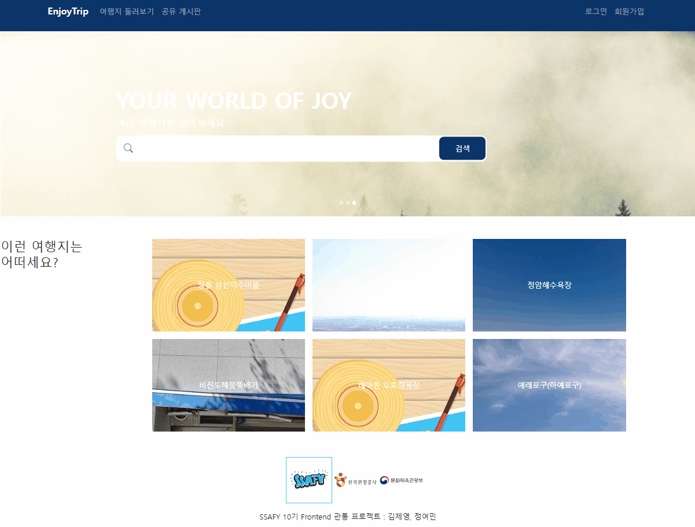
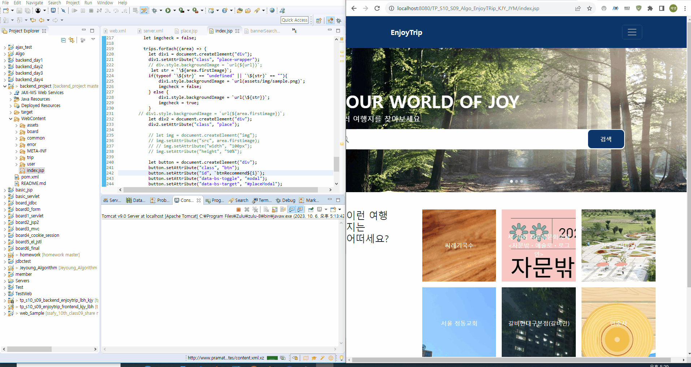

관통 프로젝트 제출 방법

# 관통프로젝트: TP*S10_S09_Algo_EnjoyTRip*김제영\_정여민

### 제출일: 2023.10.06

### 참여 페어

- 김제영(조장), 정여민

### 처리된 요구사항 목록

| 난이도 | 구현기능                                           | 세부 | 작성여부(O/X) |
| :----: | -------------------------------------------------- | ---- | :-----------: |
|  기본  | 비밀번호 검사 (Hash + Salt)                        |      |       O       |
|  기본  | 관광지 검색시 조회수가 많은 것부터 보여주기 (정렬) |      |       O       |
|  기본  | 기획서제출                                         |      |       X       |
|  추가  | 추가 알고리즘 및 기획서                            |      |       X       |

* 작성된 기능은 반드시 캡쳐되어야 합니다. 
* 추가로 구현한 기능을 표에 추가시키세요.

### 실행화면 캡쳐 -

## 알고리즘 구현

### 구현기능 1 : 비밀번호 검사 (Hash + Salt)

- 회원가입 시 비밀번호를 Hash 함수를 돌려 저장.

  이때 Salt를 사용하여 같은 비밀번호를 쓰는 다른 사용자도 안전하게 함

### 구현기능 2 : 관련 관광지 검색시 조회수가 많은 관광지부터 보여주기
Burble Sort, QuickSort 두 방식으로 구현해보았습니다.
QuickSort가 평균적으로 O(NlogN) 시간에 동작하므로 BurbleSort 보다 빠른 성능을 보여주었습니다.

